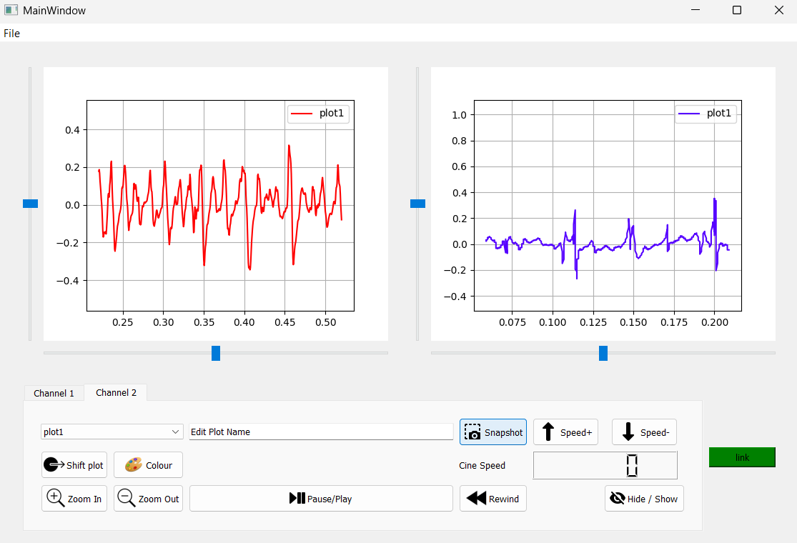

# DSP Signal Viewer

A small PyQt5 desktop app for viewing and interacting with time-series signal data from CSV files. It supports two viewing channels, basic playback controls, plot customization, snapshots, and PDF report export.


## Overview

This project is built for simple signal visualization and inspection.

Current capabilities:
- Load CSV signal data into either channel
- View signals in two separate canvases
- Play, pause, rewind, and adjust playback speed
- Zoom and scroll horizontally and vertically
- Move a plotted signal from one channel to the other
- Rename signals and change their colors
- Hide and show individual signals
- Link channels for synchronized interactions
- Capture plot snapshots
- Export snapshots and statistics to a PDF report



## Requirements

- Python 3.8+
- pip

Project dependencies:
- PyQt5
- matplotlib
- pandas
- reportlab

## Installation

```bash
git clone <repository-url>
cd DSPTask1-SignalViewer
python -m venv .venv
```

Activate the virtual environment:

Windows:

```bash
.venv\Scripts\activate
```

macOS/Linux:

```bash
source .venv/bin/activate
```

Install dependencies:

```bash
pip install -r requirements.txt
```

## Run

```bash
python main.py
```

## CSV Format

The app expects a CSV file with at least two columns:

```csv
Time,Signal
0.00,1.5
0.01,2.3
0.02,1.8
```

- Column 1 is used as the x-axis
- Column 2 is used as the y-axis

## Usage

### Load a signal

Use `File -> Open`, then choose a CSV file. The signal is loaded into the currently active tab.

### Control playback

- `Pause/Play` toggles animation
- `Speed+` and `Speed-` change playback speed
- `Rewind` resets the current signal window

### Explore the signal

- `Zoom In` and `Zoom Out` change the visible scale
- The horizontal slider moves through the signal over time
- The vertical slider shifts the visible y-range

### Manage plots

- Use the combo box to select a plot in the current channel
- Type a new name and press Enter to rename it
- Use `Colour` to change the plot color
- Use `Hide / Show` to toggle visibility
- Use `Shift plot` to move the selected plot to the other channel

### Link channels

Use the `link` button to synchronize channel interactions. When linked, the current canvas can propagate actions such as zooming, scrolling, playback control, and speed changes to the other canvas.

### Snapshots and PDF export

- `Snapshot` saves the current canvas as an image
- `File -> Report` generates `snapshots.pdf` using the saved snapshots and their statistics

> Placeholder: add a screenshot of the generated PDF here

## Project Structure

```text
DSPTask1-SignalViewer/
+-- main.py
+-- MplCanvas.py
+-- custom_slider.py
+-- create_pdf.py
+-- requirements.txt
+-- icons/
+-- data_set/
```

### Main files

`main.py`
- Builds the main window UI
- Connects UI controls to application behavior
- Manages channels, snapshots, and report generation

`MplCanvas.py`
- Handles plotting and playback logic
- Manages zooming, scrolling, linking, and signal statistics

`custom_slider.py`
- Adds a slider that emits movement difference instead of only absolute value

`create_pdf.py`
- Creates a PDF report from saved snapshots and computed statistics

## Notes

- Snapshot images are saved in the project folder as `snapshot0.png`, `snapshot1.png`, and so on
- The PDF report is saved as `snapshots.pdf`
- The app keeps loaded data in memory while it is open

## Screenshots

Placeholder: add main window screenshot here

Placeholder: add linked channels screenshot here

Placeholder: add playback/controls GIF here

Placeholder: add PDF report screenshot here
